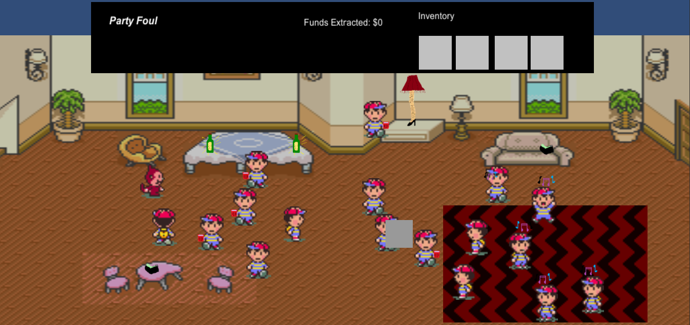
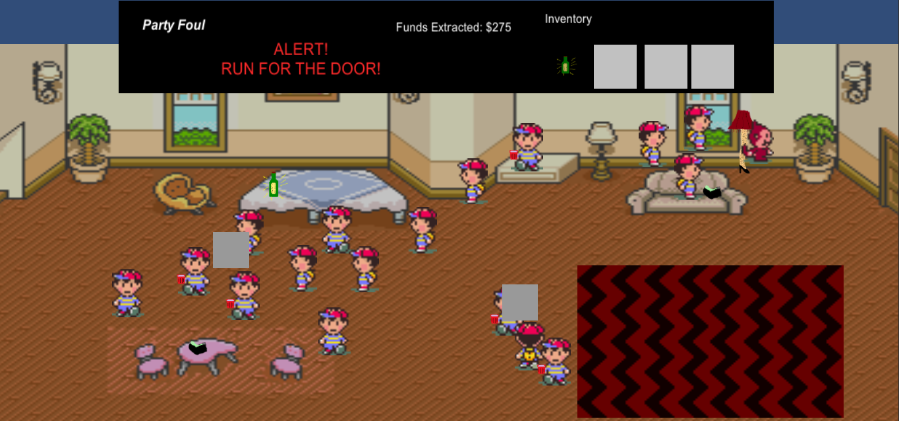

# party-foul
game prototypes for game-design/development class - created in less than a week

Unity3d - some version from 2015

Concept: Steal miscellaneous items from around the house without being seen by party-goers. 

Silly emergent behavior exhibited by guests as they gravitate toward refreshments (limited supply) and to the dance floor (depends on track that is played).

 

